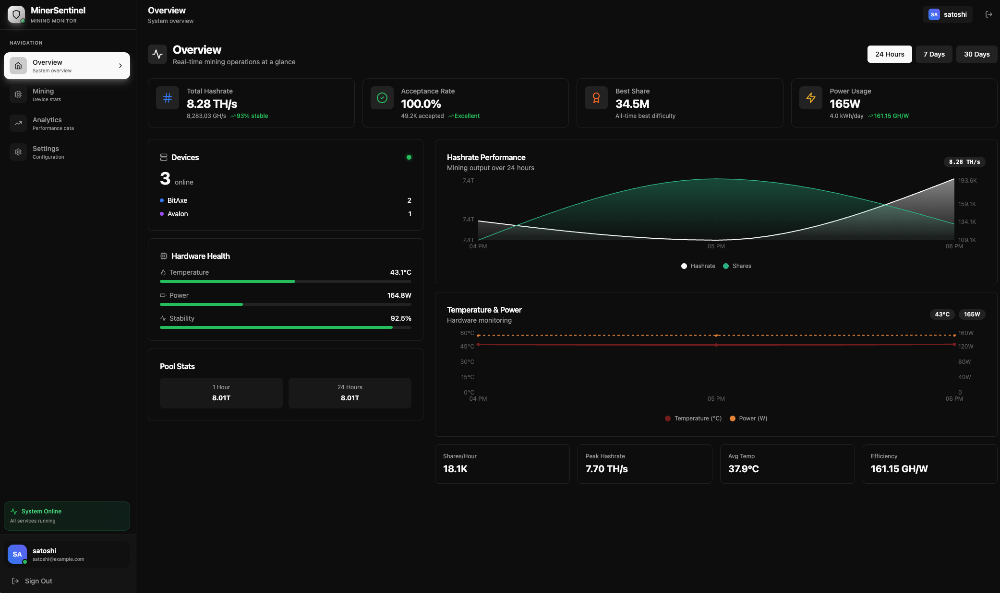
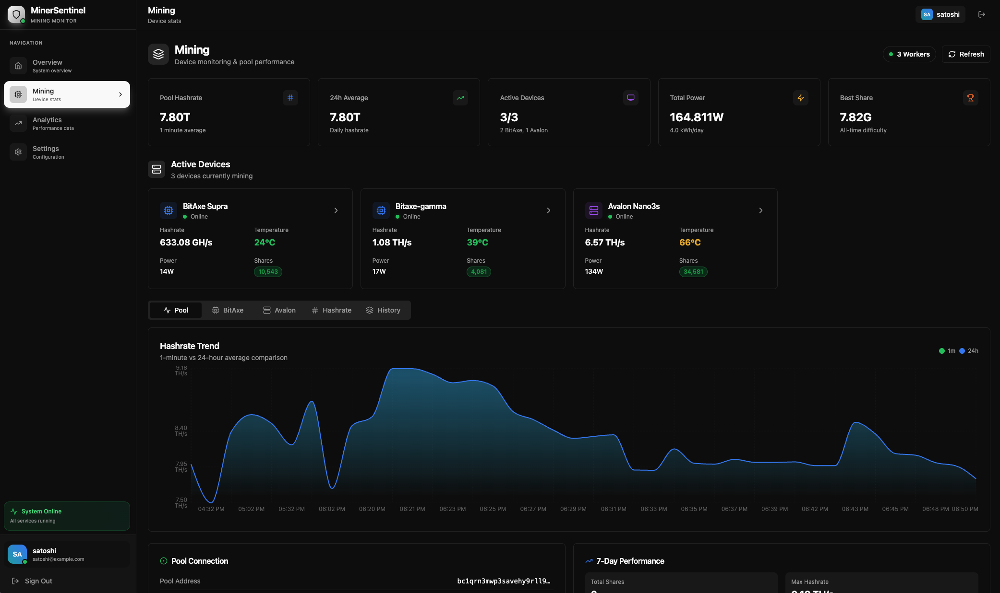
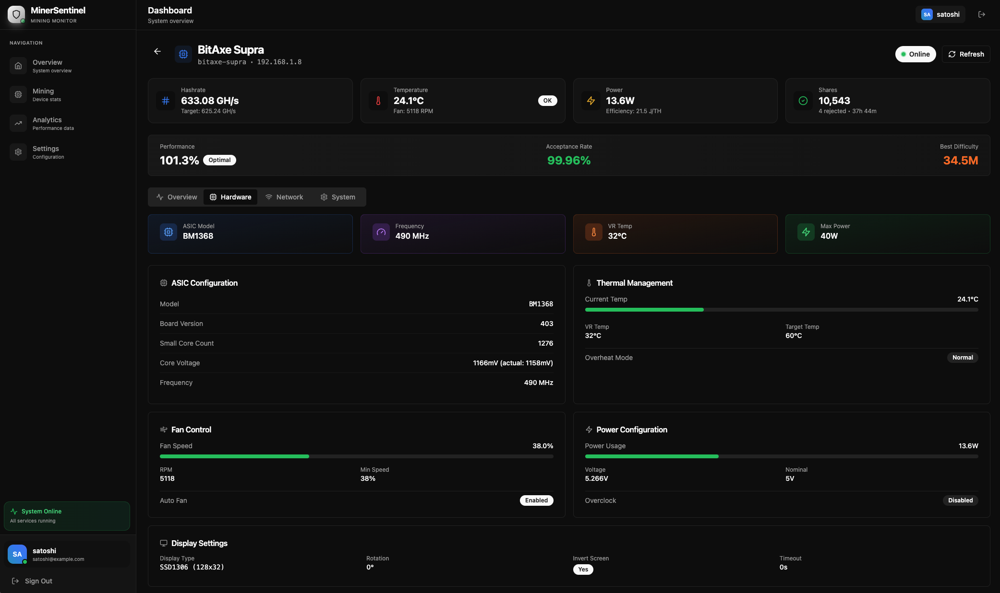
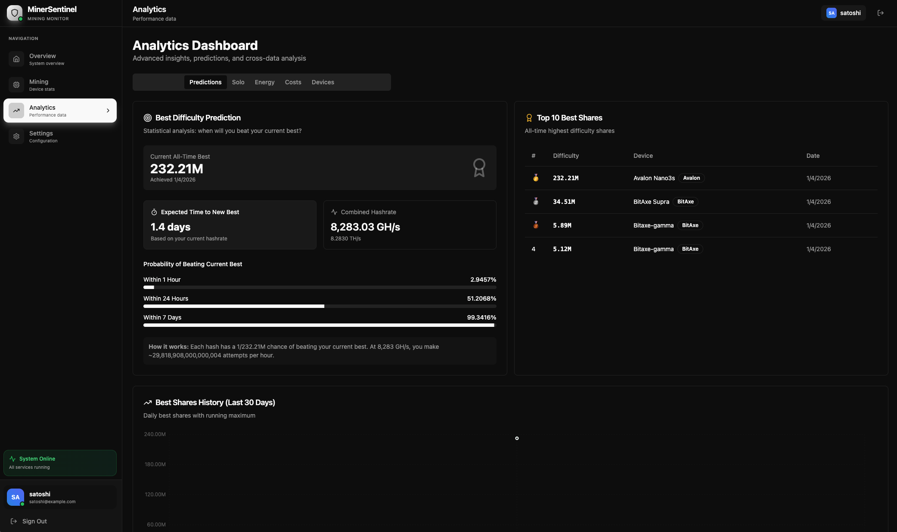
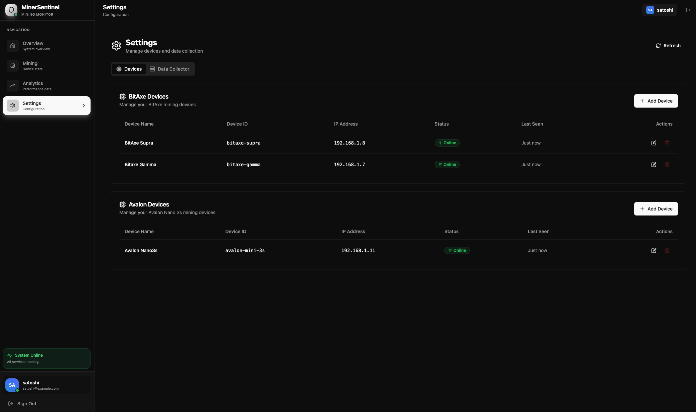
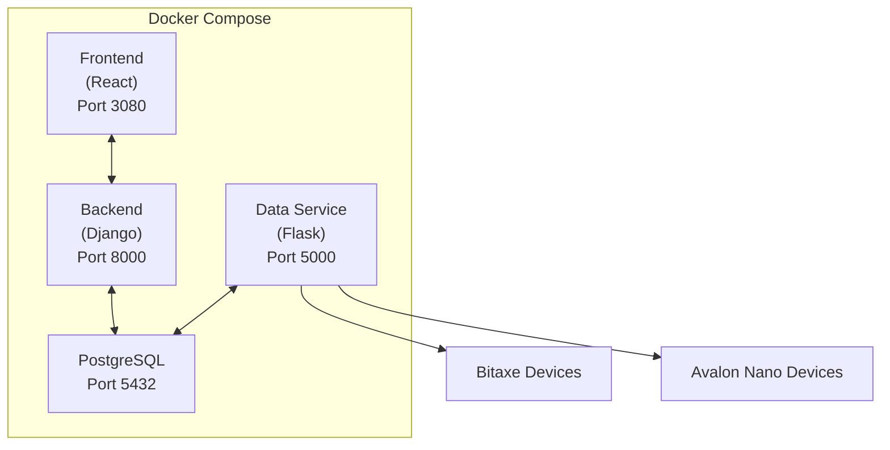

# MinerSentinel

**A self-hosted Bitcoin mining monitoring dashboard for Bitaxe and Avalon ASIC devices**


<!-- TODO: Add screenshot of the Overview Dashboard showing fleet summary, total hashrate, and device status cards -->

[](https://opensource.org/licenses/MIT)
[](https://www.docker.com/)
[](https://umbrel.com/)

---

## Overview

MinerSentinel is a comprehensive monitoring solution designed for Bitcoin home miners running Bitaxe and Avalon Nano 3s ASIC devices. Built with a modern React frontend and Django backend, it provides real-time visibility into your mining fleet's performance, health metrics, and pool statistics—all running locally on your own hardware.

### Why MinerSentinel?

Home miners often run multiple devices across different manufacturers, each with their own web interfaces and data formats. MinerSentinel solves this fragmentation by:

- **Unifying device monitoring** into a single, responsive dashboard
- **Storing historical data** for trend analysis and performance optimization
- **Providing intelligent alerts** via Telegram for critical events
- **Integrating with solo mining pools** to track your block-finding journey

---

## Screenshots

### Overview Dashboard

<!-- TODO: Capture the main dashboard showing:
     - Total fleet hashrate (combined GH/s or TH/s)
     - Device count with online/offline status indicators
     - Temperature and power consumption summary
     - Recent activity timeline
     - Mini sparkline charts for hashrate trends
-->

### Mining Dashboard

<!-- TODO: Capture the mining page showing:
     - Individual device cards for Bitaxe and Avalon miners
     - Real-time hashrate, temperature, and power per device
     - Pool statistics section (CKPool or PublicPool)
     - Best share/difficulty tracking
     - Worker status from the pool
-->

### Device Details

<!-- TODO: Capture a device detail view showing:
     - Detailed performance charts (hashrate over time)
     - Hardware health metrics (temperature, fan speed, voltage)
     - System information (firmware version, MAC address, uptime)
     - Share acceptance rate visualization
-->

### Analytics Dashboard

<!-- TODO: Capture the analytics page showing:
     - Historical performance comparison charts
     - Efficiency analysis (J/TH over time)
     - Best difficulty achievements and predictions
     - Solo mining probability calculations
     - Device comparison table
-->

### Settings Page

<!-- TODO: Capture the settings page showing:
     - Device management table (add/edit/remove miners)
     - Polling interval configuration
     - Pool selection (CKPool vs PublicPool)
     - Telegram notification settings
     - Collector service status
-->

---

## Features

### 🔌 Multi-Device Support
- **Bitaxe devices**: Full support for all Bitaxe variants (Ultra, Hex, etc.) via HTTP API
- **Avalon Nano 3s**: Native support using the cgminer socket API (port 4028)
- **Dynamic management**: Add or remove devices through the web UI without service restarts

### 📊 Real-Time Monitoring
- Hashrate tracking with historical trend visualization
- Temperature and power consumption monitoring
- Fan speed and voltage metrics
- Share acceptance/rejection statistics
- Uptime and connectivity status

### 🏊 Pool Integration
- **CKPool**: Track solo mining stats, best shares, and worker information
- **Public Pool**: Alternative pool support with similar metrics
- Configurable pool endpoints and Bitcoin addresses

### 📈 Advanced Analytics
- Historical performance charts with selectable time ranges (24h, 7d, 30d)
- Efficiency calculations (Joules per TeraHash)
- Best difficulty tracking and improvement analysis
- Solo mining probability predictions
- Device comparison and fleet-wide statistics

### 🔔 Intelligent Alerts
- **Telegram notifications** for critical events:
  - Device offline detection
  - Hashrate stagnation warnings
  - New best difficulty achievements
  - Automatic restart notifications
- **Smart recovery**: Automatic device restart attempts on stagnation detection

### 🎨 Modern UI/UX
- Built with React 18 and Shadcn UI components
- Responsive design optimized for desktop and mobile
- Dark theme by default with light mode toggle
- Interactive charts powered by Recharts
- Skeleton loading states for smooth UX

---

## Architecture

MinerSentinel consists of four containerized services:



| Service | Technology | Purpose |
|---------|------------|---------|
| **Frontend** | React 18, Vite, Shadcn UI, Tailwind CSS | User interface and visualizations |
| **Backend** | Django 5, Django REST Framework | API endpoints, authentication, data aggregation |
| **Data Service** | Flask, APScheduler | Device polling, pool data collection, notifications |
| **Database** | PostgreSQL 16 | Time-series storage for all metrics |

---

## Quick Start

### Prerequisites
- Docker and Docker Compose installed
- Bitaxe devices accessible on your network (HTTP API enabled)
- Avalon devices accessible on your network (port 4028 open)

### Installation

1. **Clone the repository**
   ```bash
   git clone https://github.com/dcbert/miner-sentinel.git
   cd minersentinel
   ```

2. **Configure environment variables**
   ```bash
   cp .env.example .env
   # Edit .env with your settings
   ```

3. **Start the services**
   ```bash
   docker-compose up -d
   ```

4. **Access the dashboard**
   - Open `http://localhost:3080` in your browser
   - Default credentials: `satoshi` / `21millionBTC!`

5. **Add your devices**
   - Navigate to Settings → Devices
   - Click "Add Device" and enter your miner's IP address

### Umbrel Installation

MinerSentinel is available in the Umbrel App Store:

1. Open your Umbrel dashboard
2. Navigate to the App Store
3. Search for "MinerSentinel"
4. Click Install

---

## Configuration

### Device Configuration

Add devices through the Settings page or Django Admin panel:

| Field | Description | Example |
|-------|-------------|---------|
| Device ID | Unique identifier | `bitaxe-01` |
| Device Name | Friendly name | `Living Room Bitaxe` |
| IP Address | Device network address | `192.168.1.100` |
| Active | Enable/disable monitoring | `true` |

### Collector Settings

Configure polling behavior through the Settings page:

| Setting | Description | Default |
|---------|-------------|---------|
| Polling Interval | How often to collect device data | 15 minutes |
| Device Check Interval | How often to detect new devices | 5 minutes |
| Pool Type | CKPool or PublicPool | CKPool |
| Pool Address | Your Bitcoin address for pool stats | — |
| Pool URL | Pool API endpoint | `https://eusolo.ckpool.org` |

### Telegram Notifications

1. Create a bot via [@BotFather](https://t.me/botfather)
2. Get your chat ID via [@userinfobot](https://t.me/userinfobot)
3. Enter credentials in Settings → Notifications

---

## API Reference

### Device Endpoints

| Method | Endpoint | Description |
|--------|----------|-------------|
| GET | `/api/bitaxe/devices/` | List all Bitaxe devices |
| GET | `/api/bitaxe/stats/<id>/` | Get device statistics |
| GET | `/api/avalon/devices/` | List all Avalon devices |
| GET | `/api/avalon/stats/<id>/` | Get device statistics |

### Pool Endpoints

| Method | Endpoint | Description |
|--------|----------|-------------|
| GET | `/api/bitaxe/pool-stats/` | Get pool statistics |
| GET | `/api/bitaxe/pool-stats/latest/` | Get latest pool data |

### Settings Endpoints

| Method | Endpoint | Description |
|--------|----------|-------------|
| GET | `/api/settings/collector/` | Get collector settings |
| PUT | `/api/settings/collector/` | Update collector settings |

---

## Development

### Local Development Setup

```bash
# Backend
cd backend
python -m venv venv
source venv/bin/activate
pip install -r requirements.txt
python manage.py migrate
python manage.py runserver

# Frontend
cd frontend
npm install
npm run dev

# Data Service
cd data-service
pip install -r requirements.txt
python app.py
```

### Running Tests

```bash
# Backend tests
cd backend && pytest

# Frontend tests
cd frontend && npm test
```

---

## Roadmap

TBD

---

## Contributing

Contributions are welcome!

---

## License

This project is licensed under the MIT License.

---

## Acknowledgments

- [Bitaxe](https://github.com/skot/bitaxe) - Open-source Bitcoin ASIC miner
- [Canaan Avalon](https://canaan.io/) - Avalon Nano 3s mining devices
- [Shadcn UI](https://ui.shadcn.com/) - Beautiful UI components
- [Umbrel](https://umbrel.com/) - Self-hosting platform

---

## Support

- **Issues**: [GitHub Issues](https://github.com/dcbert/miner-sentinel/issues)
- **Discussions**: [GitHub Discussions](https://github.com/dcbert/miner-sentinel/discussions)

---

*Built with ⚡ for the Bitcoin home mining community*
