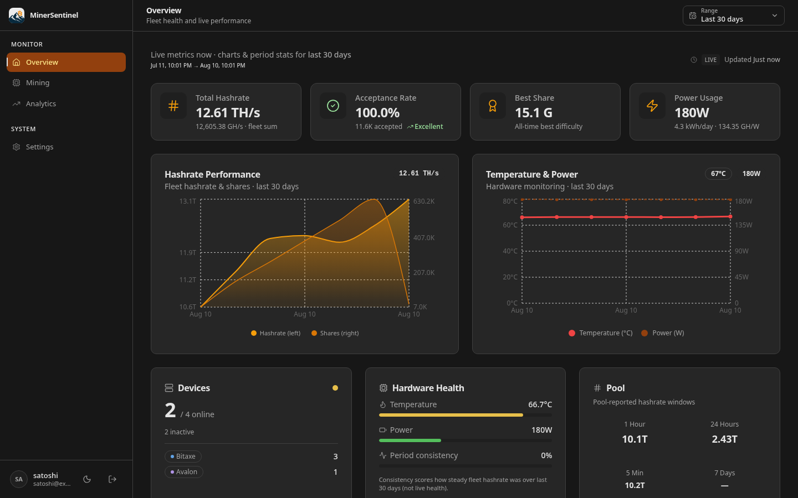
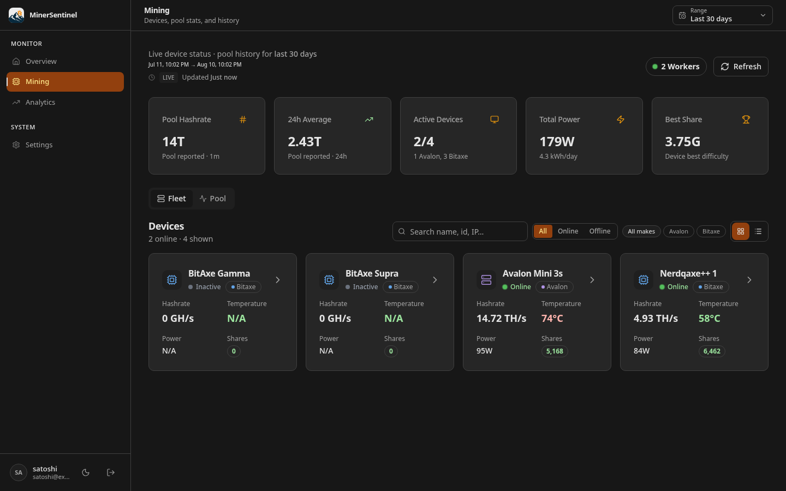
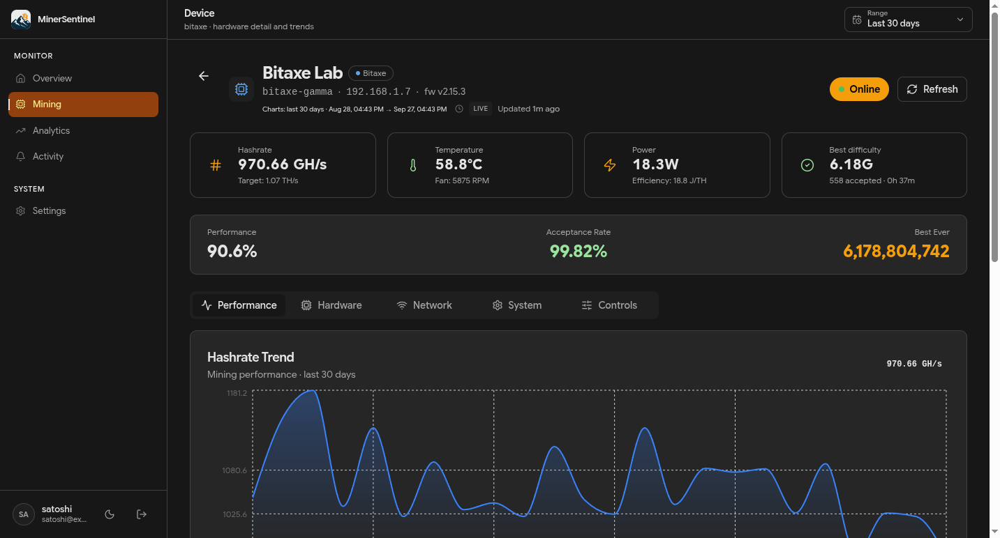
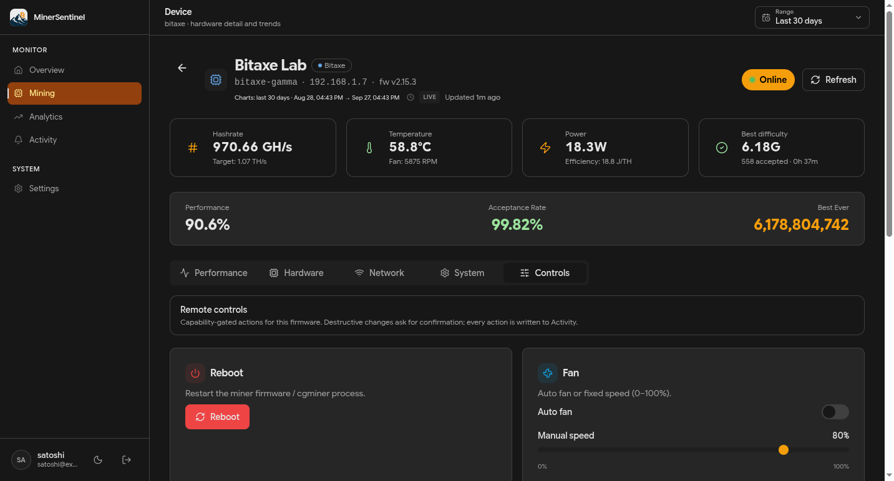
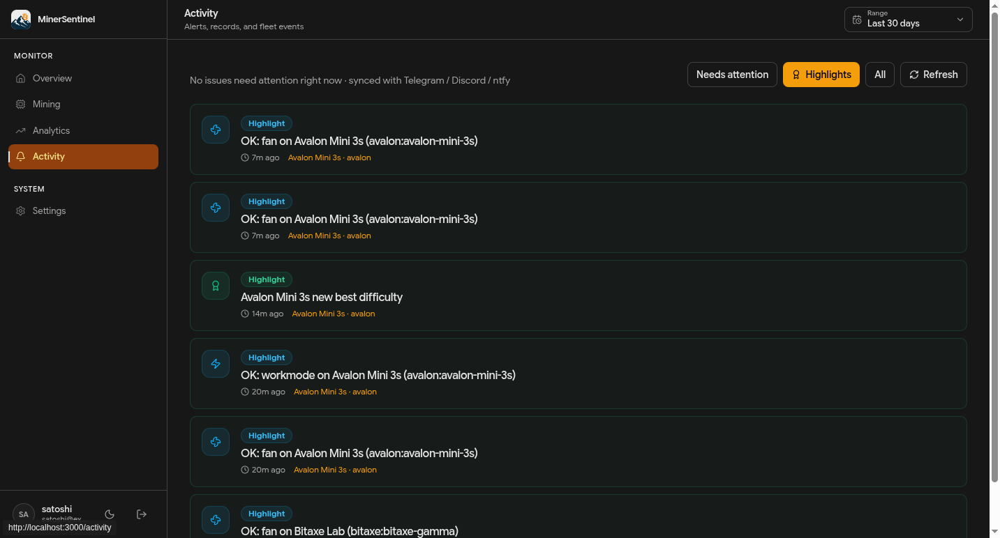
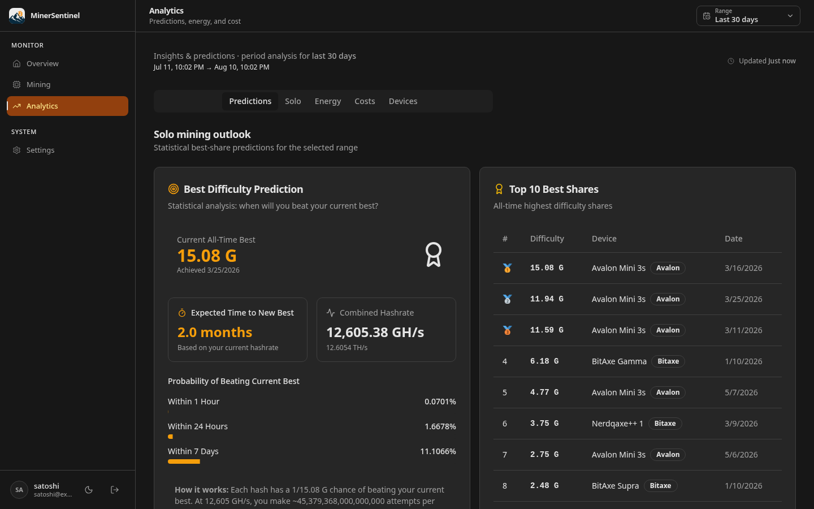
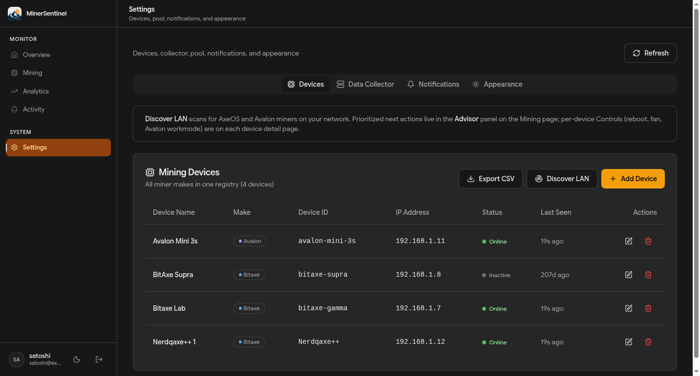
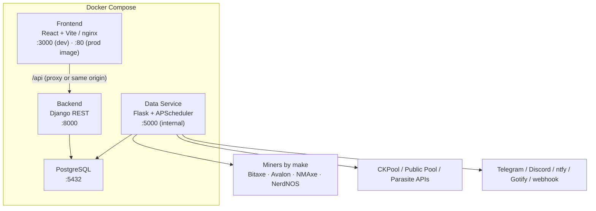

<p align="center">
  
</p>

<h1 align="center">MinerSentinel</h1>

<p align="center">
  <strong>Self-hosted Bitcoin home-mining monitor for multi-make ASIC fleets</strong>
</p>



[](https://opensource.org/licenses/MIT)
[](https://www.docker.com/)
[](https://umbrel.com/)
[](.github/workflows/ci.yml)

---

## Overview

MinerSentinel is a self-hosted monitoring stack for Bitcoin home miners. It normalizes vendor APIs into **one device registry and shared time-series tables**, then serves a single dashboard for fleet performance, hardware health, pool stats, cost analysis, **Activity alerts**, and **per-device Controls**—without sending your data to a third-party cloud.

### Why MinerSentinel?

Home fleets often mix manufacturers and firmwares, each with its own UI and metrics shape. MinerSentinel unifies that stack by:

- **One registry for all makes** (`/api/devices/`) with a make field (Bitaxe, Avalon, NMAxe, NerdNOS, …)
- **Canonical units** for hashrate (GH/s), power (W), temperature (°C), and efficiency (J/TH)
- **Historical metrics** for trends, efficiency, and device comparison
- **Alerts** on critical events via Telegram, Discord, ntfy, Gotify, or a generic webhook — plus an in-app **Activity** journal
- **Solo pool tracking** (CKPool / Public Pool / BTC PoW Lab / Parasite) including best shares
- **Energy cost and solo-mining probability** estimates from fleet hashrate
- **Remote Controls** (reboot, fan, Bitaxe freq/voltage presets, Avalon workmode) and **LAN discovery**

**New here?** Follow the step-by-step guide: **[docs/TUTORIAL.md](docs/TUTORIAL.md)**.

---

## Screenshots

| Overview | Mining | Device details |
|----------|--------|----------------|
|  |  |  |

| Controls | Activity | Analytics |
|----------|----------|-----------|
|  |  |  |

| Settings |
|----------|
|  |

---

## Features

### Multi-make device support

| Make | Integration | Notes |
|------|-------------|--------|
| **Bitaxe** (AxeOS variants, including NerdQAxe-class as bitaxe) | HTTP `/api/system/info` | Mining, hardware, system details |
| **Avalon Nano / Mini** | cgminer TCP (port **4028**) | Mining, hardware, system |
| **NMAxe / NMAxeGamma** | HTTP nested AxeOS-style API | Separate `make=nmaxe` |
| **NerdNOS** | HTTP `/api/status` | Separate `make=nerdnos` |

Devices are managed from **Settings → Devices** (or Django Admin). Adding or removing devices does not require restarting services; the data-service reloads the active list on its schedule.

All makes share:

| Table | Purpose |
|-------|---------|
| `devices` | Registry (`make` + `device_id` unique) |
| `device_mining_stats` | Hashrate, shares, best difficulty, pool identity |
| `device_hardware_stats` | Temp, power, efficiency, fans, voltage, frequency |
| `device_system_info` | Inventory + vendor `details` JSON |
| `pool_stats` | Pool time series (CKPool, Public Pool, …) |

### Real-time monitoring

- Fleet and per-device hashrate history
- Temperature, power (W), efficiency (J/TH), fan speed, voltage, frequency
- Share accept/reject counts and session/all-time best difficulty
- Online / stale / offline / inactive status from last-seen + errors
- System metadata (firmware, MAC, Wi‑Fi, stratum config, uptime) when the vendor provides it

### Pool integration

- **CKPool** (default): solo stats, workers, best shares
- **Public Pool**: configurable API URL and Bitcoin address
- **BTC PoW Lab**: hybrid solo public API
- **Parasite Pool**: public stats from parasite.space (Bitcoin address)
- Pool type and endpoints are stored in `collector_settings` and edited in Settings

### Analytics and cost analysis

- Fleet and per-device charts over selectable ranges (1h / 24h / 7d / 30d / custom)
- Efficiency and hardware health views
- Best difficulty tracking and solo mining probability estimates
- **Cost analysis**: energy rate, currency, kWh usage, optional revenue-style stats from cached network hashrate and BTC price

### Alerts & Activity

Telegram, Discord (webhook), **ntfy**, Gotify, and generic JSON webhook notifications for:

| Event | Description |
|-------|-------------|
| Device offline / back online | Reachability failures and recovery |
| Hashrate stagnation | Prolonged low/stalled hashrate |
| New best difficulty | Personal best share (**highlight**, not an “open problem”) |
| Auto-restart | Restart attempted after stagnation (where supported) |
| Temperature / fan / pool / collector | Thermal, dead fan, pool API down, collector unhealthy |
| Expected hashrate drop | Live HR below expected by a configured percent |

Credentials live under **Settings → Notifications** (secrets are write-only after save). Every alert is also stored in the **Activity** journal (`Needs attention` vs `Highlights`).

### Device Controls & discovery

- Per-device **Controls** tab: capability-gated reboot, fan (slider), Bitaxe frequency/voltage **presets + custom**, pause/resume, pool change; Avalon **workmode** (Low/Mid/High)
- Avalon frequency/voltage writes are intentionally **not** exposed (unreliable on home Nano/Mini)
- **Discover LAN** from Settings → Devices
- **Advisor** on Mining with ranked next actions and one-click control hooks
- Inventory **Export CSV**

### UI

- React 18, Vite, Tailwind CSS, Shadcn-style components
- Dark theme by default with light mode toggle
- Session auth + CSRF; login page for unauthenticated users
- Pages: **Overview**, **Mining**, **Analytics**, **Activity**, **Settings**
- Unified device detail at `/devices/:make/:deviceId` (old `/bitaxe/device/…` and `/avalon/device/…` routes redirect)
- Charts via Recharts; loading skeletons and semantic status tokens

---

## Architecture

MinerSentinel runs as four Docker services:


```mermaid
graph TB
    subgraph Docker["Docker Compose"]
        FE["Frontend<br/>React + Vite / nginx<br/>:3000 (dev) · :80 (prod image)"]
        BE["Backend<br/>Django REST<br/>:8000"]
        DS["Data Service<br/>Flask + APScheduler<br/>:5000 (internal)"]
        DB["PostgreSQL<br/>:5432"]
    end

    FE -->|"/api (proxy or same origin)"| BE
    BE --> DB
    DS --> DB
    DS --> Miners["Miners by make<br/>Bitaxe · Avalon · NMAxe · NerdNOS"]
    DS --> Pools["CKPool / Public Pool / Parasite APIs"]
    DS --> Notify["Telegram / Discord / ntfy / Gotify / webhook"]
```

| Service | Stack | Role |
|---------|-------|------|
| **Frontend** | React 18, Vite 6, Tailwind, Recharts | Dashboards, Activity, Controls, settings |
| **Backend** | Django 5, DRF, Gunicorn (prod) | REST API, auth, aggregation, analytics, control proxy |
| **Data service** | Flask, APScheduler, collectors | Polls devices & pools; writes unified tables; alerts; control adapters |
| **Database** | PostgreSQL | Devices, time-series metrics, collector settings, alert_events |

### Data flow

1. You register devices (with **make**) and pool/notification settings in the UI (or Discover LAN).
2. The **data-service** loads settings and active devices, polls on an interval (default **2 minutes** in fresh installs; editable in Settings), normalizes vendor payloads, and inserts into unified tables only.
3. Device list reloads more often (default **5 minutes**). Settings changes reapply without a full redeploy.
4. The **frontend** reads fleet data from the **unified** backend API (`/api/devices/`, `/api/mining/`, `/api/hardware/`, `/api/pool/`, `/api/activity/`, analytics).

Schema migration notes and historical dual-write work are documented in [`docs/plans/unified-device-schema.md`](docs/plans/unified-device-schema.md). Full operator walkthrough: [`docs/TUTORIAL.md`](docs/TUTORIAL.md).

---

## Quick start

### Prerequisites

- Docker and Docker Compose
- Miners reachable on the LAN (HTTP and/or TCP **4028** for Avalon)
- Optional: Telegram bot and/or Discord webhook for alerts

### Local Docker (development compose)

1. **Clone the repository**

   ```bash
   git clone https://github.com/dcbert/miner-sentinel.git
   cd miner-sentinel
   ```

2. **Configure environment**

   ```bash
   cp .env.example .env
   # Set POSTGRES_PASSWORD, SECRET_KEY, ALLOWED_HOSTS, CORS_ALLOWED_ORIGINS, etc.
   ```

3. **Start services**

   ```bash
   docker compose up -d
   ```

4. **Open the dashboard**

   | URL | Service |
   |-----|---------|
   | http://localhost:3000 | Frontend (Vite dev server in `docker-compose.yml`) |
   | http://localhost:8000 | Django API / admin |
   | http://localhost:8000/admin/ | Django Admin |

   Default superuser (dev compose, overridable via env):

   - Username: `satoshi`
   - Password: `21millionBTC!`

   Env keys: `DEFAULT_USERNAME`, `DEFAULT_PASSWORD`, `DEFAULT_EMAIL`.

5. **Add devices**

   - Settings → Devices → **Add Device** (choose make, set IP / optional port), or **Discover LAN**
   - Configure pool address and Telegram / Discord / ntfy under Settings → Notifications
   - See **[docs/TUTORIAL.md](docs/TUTORIAL.md)** for the full first-run walkthrough

### Production compose

`docker-compose.prod.yml` expects pre-built images and serves the frontend on **port 3000** (mapped to nginx :80). Point `REGISTRY_URL` / image tags at your registry and set strong secrets in `.env`.

### Umbrel

MinerSentinel is packaged under [`umbrel/`](umbrel/) for [Umbrel](https://umbrel.com/) (app id `miner-sentinel`, UI port **3080**). See [umbrel/README.md](umbrel/README.md) for packaging, multi-arch images, and install notes.

Credentials on Umbrel use the app’s deterministic password (`admin` + Umbrel-generated password).

---

## Configuration

### Environment variables

Copy [`.env.example`](.env.example) to `.env`. Important variables:

| Variable | Purpose | Typical default |
|----------|---------|-----------------|
| `POSTGRES_*` | Database name, user, password, host, port | `minersentinel` / `postgres` / `5432` |
| `SECRET_KEY` | Django secret | **required in production** |
| `DEBUG` | Django debug mode | `False` |
| `ALLOWED_HOSTS` | Host allowlist | `localhost,127.0.0.1,...` |
| `CORS_ALLOWED_ORIGINS` | Browser origins allowed to call the API | frontend origin(s) |
| `POLLING_INTERVAL_MINUTES` | Fallback/env hint for poll interval | `15` |
| `DEVICE_CHECK_INTERVAL_MINUTES` | Fallback/env hint for device reload | `5` |
| `VITE_API_BASE_URL` | Vite proxy target in development | `http://localhost:8000` |

Runtime polling, pool selection, notifications, and energy settings are primarily stored in **`collector_settings`** and edited via the Settings UI (not only `.env`).

### Device fields

| Field | Description | Example |
|-------|-------------|---------|
| Make | Vendor family | `bitaxe`, `avalon`, `nmaxe`, `nerdnos` |
| Device ID | Unique within make | `bitaxe-01` |
| Device name | Display name | `Living Room Bitaxe` |
| IP address | Device address on LAN | `192.168.1.100` |
| Port | Optional (Avalon defaults to **4028**) | `4028` |
| Active | Include in polling | `true` |

### Collector settings (Settings UI)

| Setting | Description | Default |
|---------|-------------|---------|
| Polling interval | Full collect cycle (devices + pool) | 2 minutes |
| Device check interval | Reload active devices | 5 minutes |
| Pool type | `ckpool`, `publicpool`, `btcpowlab`, or `parasite` | CKPool |
| Pool address & API URL | Address statistics source for the selected pool | see model defaults |
| Telegram | Enable, bot token, chat ID | off |
| Discord | Enable, webhook URL | off |
| ntfy / Gotify / webhook | Push channels (topic URL / Gotify / JSON POST) | off |
| Metrics retention | Days to keep device/pool stats (`0` = forever) | 90 |
| Alert retention | Days to keep resolved Activity events (`0` = forever) | 0 |
| Energy rate & currency | Cost analysis | `0.12` USD |
| Show revenue stats | Analytics cost tab | on |

Manual poll: Settings can trigger `POST /api/settings/collector/poll/` (proxied to the data-service).

### Telegram

1. Create a bot with [@BotFather](https://t.me/botfather)
2. Get your chat ID (e.g. [@userinfobot](https://t.me/userinfobot))
3. Settings → Notifications → enable Telegram and save

### Discord

1. Channel settings → Integrations → Webhooks → New webhook
2. Paste the webhook URL under Settings → Notifications → Discord

### ntfy (recommended on Umbrel)

1. Create a topic on [ntfy.sh](https://ntfy.sh) or your self-hosted ntfy
2. Settings → Notifications → enable ntfy, paste the full topic URL, optional token, Save, then **Send test**

---

## API reference

Base path: **`/api/`** (Django). Session authentication + CSRF for mutating requests from the browser.

There are **no** brand-prefixed device APIs (`/api/bitaxe/*`, `/api/avalon/*` have been removed). Use the unified endpoints below and filter by `make` when needed.

### Authentication

| Method | Endpoint | Description |
|--------|----------|-------------|
| GET | `/api/auth/csrf/` | Ensure CSRF cookie |
| POST | `/api/auth/login/` | Login |
| POST | `/api/auth/logout/` | Logout |
| GET | `/api/auth/user/` | Current user |

### Devices, mining, hardware, pool

| Method | Endpoint | Description |
|--------|----------|-------------|
| CRUD | `/api/devices/` | Device registry (`id` PK; `?make=`, `?active_only=true`) |
| GET | `/api/devices/<make>/<device_id>/details/` | Full detail payload (mining, hardware, system, trends) |
| GET | `/api/devices/<make>/<device_id>/capabilities/` | Control capability map for the Controls UI |
| POST | `/api/devices/<make>/<device_id>/control/` | Run a control action (`reboot`, `fan`, `frequency`, …) |
| POST | `/api/devices/discover/` | LAN discovery (AxeOS HTTP + Avalon :4028) |
| GET | `/api/mining/` | Mining stats (`?make=`, `?device_id=`, time window) |
| GET | `/api/mining/latest/` | Latest mining row per active device |
| GET | `/api/hardware/` | Hardware stats |
| GET | `/api/hardware/latest/` | Latest hardware row per active device |
| GET | `/api/pool/` | Pool stats history (`?pool_type=`, `?pool_address=`) |
| GET | `/api/pool/latest/` | Latest pool snapshot |
| GET | `/api/pool/hashrate_trend/` | Pool hashrate series |
| GET | `/api/pool/statistics/` | Aggregated pool stats |
| GET | `/api/pool/stratum-compare/` | Device stratum vs selected pool |

### Analytics, activity, and settings

| Method | Endpoint | Description |
|--------|----------|-------------|
| GET | `/api/overview/analytics/` | Fleet overview analytics |
| GET | `/api/analytics/detailed/` | Detailed analytics (incl. cost analysis) |
| GET | `/api/activity/` | Activity journal (`?open=`, `?kind=problem\|highlight\|all`) |
| POST | `/api/activity/<id>/acknowledge/` | Acknowledge (close) an open alert |
| POST | `/api/activity/<id>/snooze/` | Snooze for N minutes |
| GET | `/api/advisor/` | Ranked Advisor suggestions |
| GET | `/api/export/inventory.csv` | Device inventory CSV |
| GET / POST | `/api/settings/collector/` | Read / update collector settings |
| GET | `/api/settings/collector/status/` | Honest collector health (proxied `/status`) |
| POST | `/api/settings/collector/poll/` | Trigger immediate collection |
| GET | `/api/settings/network-data/` | Cached BTC price / network hashrate |
| POST | `/api/settings/network-data/refresh/` | Refresh network data cache |

### Data service (internal Flask, port 5000)

Not published in the default compose file; used by the backend / operators inside the Docker network:

| Method | Endpoint | Description |
|--------|----------|-------------|
| GET | `/health` | Health check |
| GET | `/status` | Scheduler + device counts + last poll health |
| POST | `/poll` | Manual full poll |
| POST | `/settings/reload` | Reload DB settings and reschedule jobs |
| POST | `/control` | Device control adapter entrypoint |
| POST | `/discover` | LAN discovery scan |

Django Admin remains available at `/admin/`.

---

## Project layout

```
miner-sentinel/
├── backend/                 # Django project (minersentinel) + api app
│   ├── api/                 # Unified models, views, migrations, tests
│   └── requirements*.txt
├── data-service/            # Flask collectors + notifiers + control adapters
│   ├── collectors/          # bitaxe, avalon, nmaxe, nerdnos, pools…
│   ├── control/             # reboot / fan / freq / workmode adapters
│   ├── notifications/       # Telegram, Discord, ntfy/Gotify/webhook, emitter
│   └── tests/
├── frontend/                # React (Vite) SPA
│   └── src/pages/           # Overview, Mining, Analytics, Activity, Settings, DeviceDetails
├── docs/
│   ├── TUTORIAL.md          # Complete operator tutorial
│   ├── images/              # Screenshots and logo
│   └── plans/               # Design / migration notes
├── umbrel/                  # Umbrel App Store package
├── docker-compose.yml       # Local development
├── docker-compose.prod.yml  # Production-style image deploy
├── pyproject.toml           # Shared pytest + coverage config
└── .github/workflows/       # CI and Umbrel image build/push
```

---

## Development

### Without Docker (host processes)

Requires PostgreSQL reachable with credentials matching your env, or adjust settings accordingly.

```bash
# Backend
cd backend
python -m venv venv
source venv/bin/activate   # Windows: venv\Scripts\activate
pip install -r requirements.txt
python manage.py migrate
python manage.py runserver

# Frontend (separate terminal)
cd frontend
npm install
npm run dev                # http://localhost:3000 — proxies /api → backend

# Data service (separate terminal)
cd data-service
pip install -r requirements.txt
python app.py              # Flask on :5000
```

### Running tests

CI runs the same suites via [`.github/workflows/ci.yml`](.github/workflows/ci.yml) (Node 20, Python 3.12).

**Frontend (Vitest)**

```bash
cd frontend
npm ci
npm run test:run           # single run
npm run test:coverage      # coverage thresholds in vite.config.js
npm run lint
npm run build
```

**Backend (pytest + Django test settings)**

```bash
pip install -r backend/requirements.txt \
            -r backend/requirements-test.txt \
            -r backend/requirements-dev.txt

PYTHONPATH=backend DJANGO_SETTINGS_MODULE=minersentinel.settings_test \
  python -m pytest backend/api/tests -v --tb=short -c pyproject.toml
```

**Data service (pytest, skip live/integration tests)**

```bash
pip install -r data-service/requirements.txt \
            -r data-service/requirements-dev.txt

PYTHONPATH=data-service \
  python -m pytest data-service/tests -v --tb=short -c pyproject.toml -m "not integration"
```

Root [`pyproject.toml`](pyproject.toml) holds shared pytest options and coverage source paths. Integration-marked tests may require live devices and are excluded in CI.

### Useful compose commands

```bash
docker compose up -d --build
docker compose logs -f data-service
docker compose exec backend python manage.py createsuperuser
docker compose exec backend python manage.py seed_lab_devices
docker compose exec backend python manage.py prune_retention
docker compose down
```

### Verify unified schema (installed systems)

```bash
docker compose exec backend python manage.py verify_device_unification
```

---

## Documentation

| Doc | Contents |
|-----|----------|
| [docs/TUTORIAL.md](docs/TUTORIAL.md) | Complete install → devices → pool → alerts → Controls tutorial |
| [umbrel/README.md](umbrel/README.md) | Umbrel packaging and install notes |
| [docs/plans/unified-device-schema.md](docs/plans/unified-device-schema.md) | Schema unification design notes |

---

## Roadmap

Ideas under consideration (not commitments):

- Additional miner adapters (Antminer, Whatsminer, Braiins BMM) — read-only first; Braiins/Antminer write control deferred until vendor APIs are verified
- Concurrent multi-pool polling of every pool type (UI already compares device stratum vs the selected pool)
- Export/import of full settings packs
- Browser Web Push (VAPID) — ntfy / Gotify / webhook already supported for Umbrel-friendly push

Contributions and issue reports welcome.

---

## Contributing

1. Fork and create a feature branch from `main`
2. Keep changes focused; match existing style
3. Add or update tests where practical
4. Ensure CI-relevant checks pass locally (frontend tests, backend pytest, data-service unit tests)
5. Open a pull request with a clear description of the change

Please follow the [Code of Conduct](CODE_OF_CONDUCT.md).

---

## License

This project is licensed under the [MIT License](LICENSE).

---

## Acknowledgments

- [Bitaxe](https://github.com/skot/bitaxe) — open-source Bitcoin ASIC miner
- [Canaan Avalon](https://canaan.io/) — Avalon mining devices
- [Shadcn UI](https://ui.shadcn.com/) — UI component patterns
- [Umbrel](https://umbrel.com/) — self-hosting platform

---

## Support

- **Issues**: [GitHub Issues](https://github.com/dcbert/miner-sentinel/issues)
- **Discussions**: [GitHub Discussions](https://github.com/dcbert/miner-sentinel/discussions)

---

*Built with ⚡ for the Bitcoin home mining community*
