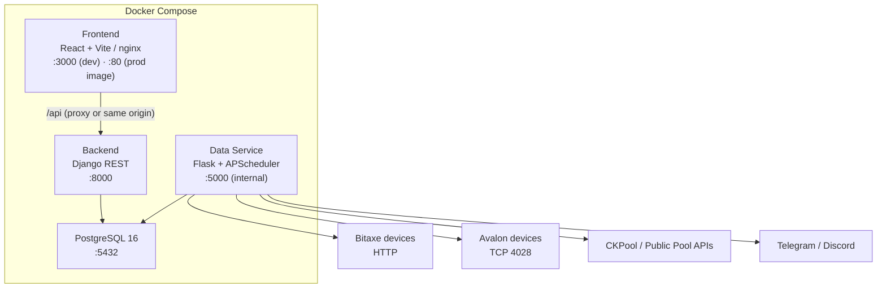

<p align="center">
  
</p>

<h1 align="center">MinerSentinel</h1>

<p align="center">
  <strong>A self-hosted Bitcoin mining monitoring dashboard for Bitaxe and Avalon ASIC devices</strong>
</p>


[](https://opensource.org/licenses/MIT)
[](https://www.docker.com/)
[](https://umbrel.com/)
[](.github/workflows/ci.yml)

---

## Overview

MinerSentinel is a comprehensive monitoring solution for Bitcoin home miners running **Bitaxe** and **Avalon Nano 3s** ASIC devices. Built with a React frontend and Django backend, it provides local visibility into fleet performance, hardware health, pool statistics, cost analysis, and alerts—without sending your data to a third-party cloud.

### Why MinerSentinel?

Home miners often run devices from different manufacturers, each with its own web UI and data format. MinerSentinel unifies that stack by:

- **Centralizing device monitoring** in one responsive dashboard
- **Storing historical metrics** for trends, efficiency, and comparison
- **Alerting on critical events** via Telegram and Discord
- **Tracking solo mining pools** (CKPool / Public Pool) including best shares
- **Estimating energy cost and solo-mining probability** from your fleet hashrate

---

## Screenshots

| Overview | Mining | Device details |
|----------|--------|----------------|
|  |  |  |

| Analytics | Settings |
|-----------|----------|
|  |  |

---

## Features

### Multi-device support

| Device | Integration | Notes |
|--------|-------------|--------|
| **Bitaxe** (Ultra, Hex, and other AxeOS variants) | HTTP API | Mining stats, hardware logs, system info |
| **Avalon Nano 3s** | cgminer socket API (port **4028**) | Mining stats, hardware logs, remote restart |

Devices are managed from **Settings** (or Django Admin). Adding/removing devices does not require restarting services; the data-service reloads the active device list on its schedule.

### Real-time monitoring

- Hashrate history and trend charts
- Temperature, power (W), efficiency (J/TH), fan speed, voltage, frequency
- Share accept/reject counts and session/all-time best difficulty
- Online/offline status with last-seen timestamps
- System metadata (firmware, MAC, Wi‑Fi, stratum config, uptime)

### Pool integration

- **CKPool** (default): solo stats, workers, best shares (`https://eusolo.ckpool.org` by default)
- **Public Pool**: configurable API URL and Bitcoin address
- Pool type and endpoints are stored in the database and editable in Settings

### Analytics and cost analysis

- Fleet and per-device historical charts (selectable periods such as 24h / 7d / 30d)
- Efficiency and hardware health views
- Best difficulty tracking and solo mining probability estimates
- **Cost analysis**: energy rate, currency (USD/EUR/GBP/CHF), kWh usage, and optional revenue-style stats driven by cached network hashrate and BTC price

### Alerts

Telegram and Discord (webhook) notifications for:

| Event | Description |
|-------|-------------|
| Device offline / back online | Reachability failures and recovery |
| Hashrate stagnation | Prolonged low/stalled hashrate |
| New best difficulty | Personal best share difficulty |
| Auto-restart | Restart attempted after stagnation (where supported) |

Credentials are configured in **Settings → Notifications** (secrets are not returned by the API after save).

### UI

- React 18, Vite, Tailwind CSS, Shadcn-style UI components
- Dark theme by default with light mode toggle
- Auth-gated app (session + CSRF); login page for non-authenticated users
- Pages: **Overview**, **Mining**, **Analytics**, **Settings**, plus Bitaxe/Avalon device detail routes
- Charts via Recharts; skeleton loading states

---

## Architecture

MinerSentinel runs as four Docker services:


```mermaid
graph TB
    subgraph Docker["Docker Compose"]
        FE["Frontend<br/>React + Vite / nginx<br/>:3000 (dev) · :80 (prod image)"]
        BE["Backend<br/>Django REST<br/>:8000"]
        DS["Data Service<br/>Flask + APScheduler<br/>:5000 (internal)"]
        DB["PostgreSQL 16<br/>:5432"]
    end

    FE -->|"/api (proxy or same origin)"| BE
    BE --> DB
    DS --> DB
    DS --> Bitaxe["Bitaxe devices<br/>HTTP"]
    DS --> Avalon["Avalon devices<br/>TCP 4028"]
    DS --> Pools["CKPool / Public Pool APIs"]
    DS --> Notify["Telegram / Discord"]
```

| Service | Stack | Role |
|---------|-------|------|
| **Frontend** | React 18, Vite 6, Tailwind, Recharts | Dashboards and settings UI |
| **Backend** | Django 5, DRF, Gunicorn (prod) | REST API, auth, aggregation, analytics |
| **Data service** | Flask, APScheduler, collectors | Polls devices & pools; writes Postgres; sends alerts |
| **Database** | PostgreSQL 16 | Devices, time-series metrics, collector settings |

### Data flow

1. You register Bitaxe/Avalon devices and pool/notification settings in the UI (persisted via the Django API).
2. The **data-service** loads settings and active devices from Postgres, polls on an interval (default **15 minutes**), and stores mining/hardware/system/pool rows.
3. Device list reloads more often (default **5 minutes**). Settings changes are reapplied without a full redeploy.
4. The **frontend** reads aggregated data from the **backend** API (`/api/...`).

---

## Quick start

### Prerequisites

- Docker and Docker Compose
- Bitaxe devices reachable over HTTP (AxeOS API)
- Avalon devices reachable on TCP **4028**
- Optional: Telegram bot and/or Discord webhook for alerts

### Local Docker (development compose)

1. **Clone the repository**

   ```bash
   git clone https://github.com/dcbert/miner-sentinel.git
   cd miner-sentinel
   ```

2. **Configure environment**

   ```bash
   cp .env.example .env
   # Set POSTGRES_PASSWORD, SECRET_KEY, ALLOWED_HOSTS, CORS_ALLOWED_ORIGINS, etc.
   ```

3. **Start services**

   ```bash
   docker compose up -d
   ```

4. **Open the dashboard**

   | URL | Service |
   |-----|---------|
   | http://localhost:3000 | Frontend (Vite dev server in `docker-compose.yml`) |
   | http://localhost:8000 | Django API / admin |
   | http://localhost:8000/admin/ | Django Admin |

   Default superuser (dev compose, overridable via env):

   - Username: `satoshi`
   - Password: `21millionBTC!`

   Env keys: `DEFAULT_USERNAME`, `DEFAULT_PASSWORD`, `DEFAULT_EMAIL`.

5. **Add devices**

   - Settings → Devices → Add Device (Bitaxe or Avalon IP)
   - Configure pool address and optional Telegram/Discord under Settings

### Production compose

`docker-compose.prod.yml` expects pre-built images and serves the frontend on **port 3000** (mapped to nginx :80). Point `REGISTRY_URL` / image tags at your registry and set strong secrets in `.env`.

### Umbrel

MinerSentinel is packaged under [`umbrel/`](umbrel/) for [Umbrel](https://umbrel.com/) (app id `miner-sentinel`, UI port **3080**). See [umbrel/README.md](umbrel/README.md) for packaging, multi-arch images, and install notes.

Credentials on Umbrel use the app’s deterministic password (`admin` + Umbrel-generated password).

---

## Configuration

### Environment variables

Copy [`.env.example`](.env.example) to `.env`. Important variables:

| Variable | Purpose | Typical default |
|----------|---------|-----------------|
| `POSTGRES_*` | Database name, user, password, host, port | `minersentinel` / `postgres` / `5432` |
| `SECRET_KEY` | Django secret | **required in production** |
| `DEBUG` | Django debug mode | `False` |
| `ALLOWED_HOSTS` | Host allowlist | `localhost,127.0.0.1,...` |
| `CORS_ALLOWED_ORIGINS` | Browser origins allowed to call the API | frontend origin(s) |
| `POLLING_INTERVAL_MINUTES` | Fallback/env hint for poll interval | `15` |
| `DEVICE_CHECK_INTERVAL_MINUTES` | Fallback/env hint for device reload | `5` |
| `VITE_API_BASE_URL` | Vite proxy target in development | `http://localhost:8000` |

Runtime polling, pool selection, notifications, and energy settings are primarily stored in the **`collector_settings`** table and edited via the Settings UI (not only `.env`).

### Device fields

| Field | Description | Example |
|-------|-------------|---------|
| Device ID | Unique id (lookup key in API) | `bitaxe-01` |
| Device name | Display name | `Living Room Bitaxe` |
| IP address | Device address on LAN | `192.168.1.100` |
| Active | Include in polling | `true` |

### Collector settings (Settings UI)

| Setting | Description | Default |
|---------|-------------|---------|
| Polling interval | Full collect cycle (devices + pool) | 15 minutes |
| Device check interval | Reload active devices | 5 minutes |
| Pool type | `ckpool` or `publicpool` | CKPool |
| CKPool / Public Pool address & URL | Solo stats source | see model defaults |
| Telegram | Enable, bot token, chat ID | off |
| Discord | Enable, webhook URL | off |
| Energy rate & currency | Cost analysis | `0.12` USD |
| Show revenue stats | Analytics cost tab | on |

Manual poll: Settings can trigger `POST /api/settings/collector/poll/` (proxied to the data-service).

### Telegram

1. Create a bot with [@BotFather](https://t.me/botfather)
2. Get your chat ID (e.g. [@userinfobot](https://t.me/userinfobot))
3. Settings → Notifications → enable Telegram and save

### Discord

1. Channel settings → Integrations → Webhooks → New webhook
2. Paste the webhook URL under Settings → Notifications → Discord

---

## API reference

Base path: **`/api/`** (Django). Session authentication + CSRF for mutating requests from the browser.

### Authentication

| Method | Endpoint | Description |
|--------|----------|-------------|
| GET | `/api/auth/csrf/` | Ensure CSRF cookie |
| POST | `/api/auth/login/` | Login |
| POST | `/api/auth/logout/` | Logout |
| GET | `/api/auth/user/` | Current user |

### Bitaxe (DRF viewsets)

| Method | Endpoint | Description |
|--------|----------|-------------|
| CRUD | `/api/bitaxe/devices/` | Device registry (`lookup`: `device_id`) |
| GET | `/api/bitaxe/mining/` | Mining stats (filter `?device_id=`) |
| GET | `/api/bitaxe/mining/latest/` | Latest mining row per active device |
| GET | `/api/bitaxe/mining/hashrate_trend/` | Hashrate series (`?hours=24`) |
| GET | `/api/bitaxe/hardware/` | Hardware logs |
| GET | `/api/bitaxe/hardware/latest/` | Latest hardware row per device |
| GET | `/api/bitaxe/hardware/temperature_trend/` | Temperature series |
| GET | `/api/bitaxe/system/` | System info snapshots |
| GET | `/api/bitaxe/system/device/<device_id>/` | Latest system info for one device |
| GET | `/api/bitaxe/pool/` | Pool stats history |
| GET | `/api/bitaxe/pool/latest/` | Latest pool snapshot |
| GET | `/api/bitaxe/pool/hashrate_trend/` | Pool hashrate series |
| GET | `/api/bitaxe/pool/statistics/` | Aggregated pool stats |

### Avalon

| Method | Endpoint | Description |
|--------|----------|-------------|
| GET / POST | `/api/avalon/devices/` | List / create devices |
| GET / PUT / DELETE | `/api/avalon/devices/<device_id>/` | Detail / update / delete |
| GET | `/api/avalon/dashboard/` | Dashboard aggregates |
| GET | `/api/avalon/mining-stats/` | Mining history |
| GET | `/api/avalon/hardware-logs/` | Hardware history |
| GET | `/api/avalon/hashrate-trends/` | Hashrate trends |
| GET | `/api/avalon/temperature-trends/` | Temperature trends |
| POST | `/api/avalon/devices/<device_id>/restart/` | Send restart via socket API |

### Analytics and settings

| Method | Endpoint | Description |
|--------|----------|-------------|
| GET | `/api/overview/analytics/` | Fleet overview analytics |
| GET | `/api/analytics/detailed/` | Detailed analytics (incl. cost analysis) |
| GET / POST | `/api/settings/collector/` | Read / update collector settings |
| POST | `/api/settings/collector/poll/` | Trigger immediate collection |
| GET | `/api/settings/network-data/` | Cached BTC price / network hashrate |
| POST | `/api/settings/network-data/refresh/` | Refresh network data cache |

### Data service (internal Flask, port 5000)

Not published in the default compose file; used by the backend / operators inside the Docker network:

| Method | Endpoint | Description |
|--------|----------|-------------|
| GET | `/health` | Health check |
| GET | `/status` | Scheduler + device counts |
| POST | `/poll` | Manual full poll |
| POST | `/settings/reload` | Reload DB settings and reschedule jobs |

Django Admin remains available at `/admin/`.

---

## Project layout

```
miner-sentinel/
├── backend/                 # Django project (minersentinel) + api app
│   ├── api/                 # Models, serializers, views, migrations, tests
│   └── requirements*.txt
├── data-service/            # Flask collectors + Telegram/Discord notifiers
│   ├── collectors/          # bitaxe, avalon, ckpool, publicpool
│   ├── notifications/
│   └── tests/
├── frontend/                # React (Vite) SPA
│   └── src/pages/           # Overview, Mining, Analytics, Settings, details
├── docs/images/             # Screenshots and logo
├── umbrel/                  # Umbrel App Store package
├── docker-compose.yml       # Local development
├── docker-compose.prod.yml  # Production-style image deploy
├── pyproject.toml           # Shared pytest + coverage config
└── .github/workflows/       # CI and Umbrel image build/push
```

---

## Development

### Without Docker (host processes)

Requires PostgreSQL reachable with credentials matching your env, or adjust settings accordingly.

```bash
# Backend
cd backend
python -m venv venv
source venv/bin/activate   # Windows: venv\Scripts\activate
pip install -r requirements.txt
python manage.py migrate
python manage.py runserver

# Frontend (separate terminal)
cd frontend
npm install
npm run dev                # http://localhost:3000 — proxies /api → backend

# Data service (separate terminal)
cd data-service
pip install -r requirements.txt
python app.py              # Flask on :5000
```

### Running tests

CI runs the same suites via [`.github/workflows/ci.yml`](.github/workflows/ci.yml) (Node 20, Python 3.12).

**Frontend (Vitest)**

```bash
cd frontend
npm ci
npm run test:run           # single run
npm run test:coverage      # coverage thresholds in vite.config.js
npm run lint
npm run build
```

**Backend (pytest + Django test settings)**

```bash
pip install -r backend/requirements.txt \
            -r backend/requirements-test.txt \
            -r backend/requirements-dev.txt

PYTHONPATH=backend DJANGO_SETTINGS_MODULE=minersentinel.settings_test \
  python -m pytest backend/api/tests -v --tb=short -c pyproject.toml
```

**Data service (pytest, skip live/integration tests)**

```bash
pip install -r data-service/requirements.txt \
            -r data-service/requirements-dev.txt

PYTHONPATH=data-service \
  python -m pytest data-service/tests -v --tb=short -c pyproject.toml -m "not integration"
```

Root [`pyproject.toml`](pyproject.toml) holds shared pytest options and coverage source paths (`data-service/collectors`, `data-service/notifications`, `backend/api`, etc.). Integration-marked tests may require live devices and are excluded in CI.

### Useful compose commands

```bash
docker compose up -d --build
docker compose logs -f data-service
docker compose exec backend python manage.py createsuperuser
docker compose down
```

---

## Roadmap

Ideas under consideration (not commitments):

- Broader miner/firmware support beyond Bitaxe + Avalon Nano 3s
- Richer multi-pool worker views
- Export/import of device inventory and settings
- Optional long-term metric retention policies

Contributions and issue reports welcome.

---

## Contributing

1. Fork and create a feature branch from `main`
2. Keep changes focused; match existing style
3. Add or update tests where practical
4. Ensure CI-relevant checks pass locally (frontend tests, backend pytest, data-service unit tests)
5. Open a pull request with a clear description of the change

Please follow the [Code of Conduct](CODE_OF_CONDUCT.md).

---

## License

This project is licensed under the [MIT License](LICENSE).

---

## Acknowledgments

- [Bitaxe](https://github.com/skot/bitaxe) — open-source Bitcoin ASIC miner
- [Canaan Avalon](https://canaan.io/) — Avalon Nano mining devices
- [Shadcn UI](https://ui.shadcn.com/) — UI component patterns
- [Umbrel](https://umbrel.com/) — self-hosting platform

---

## Support

- **Issues**: [GitHub Issues](https://github.com/dcbert/miner-sentinel/issues)
- **Discussions**: [GitHub Discussions](https://github.com/dcbert/miner-sentinel/discussions)

---

*Built with ⚡ for the Bitcoin home mining community*
